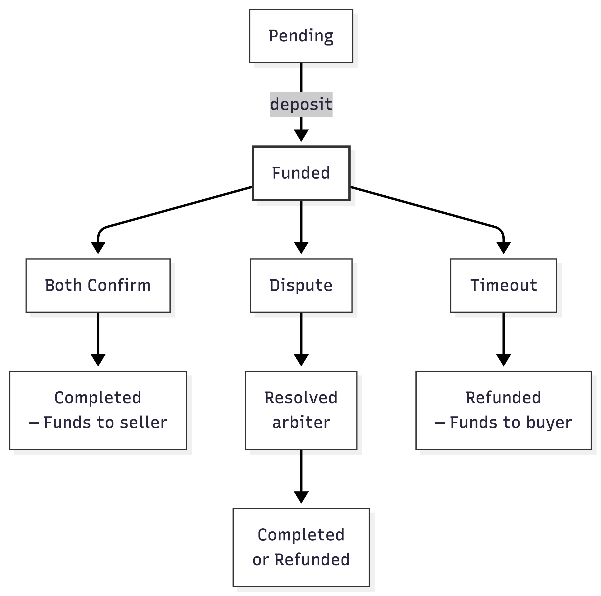

<div align="center">

**Made by [Parithosh Varma](https://github.com/Parithosh-Varma)**

# Decentralized Escrow System

**A trustless, multi-party escrow smart contract for secure transactions on EVM-compatible chains**

[](https://soliditylang.org/)
[](https://hardhat.org/)
[](https://openzeppelin.com/contracts/)
[](LICENSE)
[]()

</div>

---

## Overview

The Decentralized Escrow system enables **trustless transactions** between buyers and sellers by locking funds in a smart contract until agreed-upon conditions are met. A neutral arbiter resolves disputes, and a built-in timeout mechanism prevents indefinite fund locks.

**Supported Chains:** Ethereum, Polygon, Arbitrum, Optimism, and any EVM-compatible network.

## Table of Contents

- [Features](#features)
- [How It Works](#how-it-works)
- [Quick Start](#quick-start)
- [Smart Contract API](#smart-contract-api)
- [Deployment](#deployment)
- [Testing](#testing)
- [Security](#security)
- [Frontend Integration](#frontend-integration)
- [Events Reference](#events-reference)
- [Architecture](#architecture)
- [License](#license)

---

## Features

| Feature | Description |
|---------|-------------|
| **Multi-token support** | Native ETH and any ERC-20 token |
| **Multi-sig release** | Requires both buyer and seller confirmation, or an arbiter decision |
| **Dispute resolution** | Three-party mechanism (buyer, seller, arbiter) |
| **Timeout refund** | Buyers can reclaim funds after expiration |
| **Fee structure** | Configurable 0.5%–2% fee on successful transactions only |
| **Arbiter registry** | Whitelist with reputation tracking |
| **Batch operations** | Create and fund multiple escrows in a single transaction |
| **Emergency pause** | Admin can halt the contract during incidents |
| **Rate limiting** | 24-hour cooldown between disputes, max 3 per escrow |

---

## How It Works

### State Machine



### Status Reference

| Status | Value | Description |
|--------|-------|-------------|
| Pending | 0 | Escrow created, awaiting deposit |
| Funded | 1 | Funds deposited and locked |
| Completed | 2 | Funds released to seller |
| Disputed | 3 | Dispute opened, awaiting arbiter |
| Refunded | 4 | Funds returned to buyer |

---

## Quick Start

### Prerequisites

```bash
node >= 18.0.0
npm
```

### Setup

```bash
# Clone and install
git clone https://github.com/Parithosh-Varma/Escrow.git
cd Escrow
npm install

# Configure environment
cp .env.example .env
# Edit .env with your PRIVATE_KEY and RPC URLs
```

### Run Tests

```bash
npx hardhat test
```

---

## Smart Contract API

### Constructor

```solidity
constructor(address _admin, address _treasury, uint256 _defaultFeePercent)
```

| Param | Type | Description |
|-------|------|-------------|
| `_admin` | `address` | Admin address for privileged functions |
| `_treasury` | `address` | Fee recipient address |
| `_defaultFeePercent` | `uint256` | Fee in basis points (100 = 1%, max 200 = 2%) |

### Core Functions

#### `createEscrow`
```solidity
function createEscrow(
    address seller,
    address arbiter,
    address token,
    uint256 amount,
    uint256 expiration,
    uint256 feePercent
) external returns (uint256 escrowId);
```

#### `deposit`
```solidity
function deposit(uint256 escrowId) external payable;
```
Sends `msg.value` for ETH escrows, or requires prior `approve()` for ERC-20 escrows.

#### `confirmByBuyer` / `confirmBySeller`
```solidity
function confirmByBuyer(uint256 escrowId) external;
function confirmBySeller(uint256 escrowId) external;
```
Sets the respective confirmation flag. When both are set and the escrow is funded, funds are automatically released to the seller.

#### `release`
```solidity
function release(uint256 escrowId) external;
```
Manually triggers fund release when both parties have confirmed.

#### `openDispute`
```solidity
function openDispute(uint256 escrowId) external;
```
Only callable by buyer or seller when the escrow is funded. Requires a whitelisted arbiter and respects the 24-hour cooldown.

#### `resolveDispute`
```solidity
function resolveDispute(uint256 escrowId, EscrowStatus resolution) external;
```
Only the assigned arbiter can call this. Resolution must be `Completed` (2) or `Refunded` (4).

#### `requestRefund`
```solidity
function requestRefund(uint256 escrowId) external;
```
Only the buyer can call after the expiration timestamp has passed.

### Admin Functions

| Function | Description |
|----------|-------------|
| `pause()` / `unpause()` | Emergency halt / resume |
| `addArbiter(address)` | Whitelist an arbiter |
| `removeArbiter(address)` | Remove from whitelist |
| `updateReputation(address, uint256)` | Update arbiter reputation (0–100) |
| `updateTreasury(address)` | Change fee recipient |
| `updateDefaultFee(uint256)` | Change default fee percent |
| `emergencyWithdraw(address)` | Withdraw all funds of a token (only when paused) |
| `transferAdmin(address)` | Transfer admin role |

### Arbiter Registry

| Function | Description |
|----------|-------------|
| `isApprovedArbiter(address)` | Check if an address is a whitelisted arbiter |
| `getArbiterCount()` | Total whitelisted arbiters |
| `getArbiter(uint256)` | Get arbiter address by index |
| `arbiters(address)` | Get arbiter details (isApproved, reputation, casesResolved, totalDisputes) |

---

## Deployment

### Local Network

```bash
npx hardhat node &
npx hardhat run scripts/deploy.js --network localhost
```

### Testnets & Mainnets

```bash
# Sepolia
npx hardhat run scripts/deploy.js --network sepolia

# Polygon
npx hardhat run scripts/deploy.js --network polygon

# Arbitrum
npx hardhat run scripts/deploy.js --network arbitrum

# Optimism
npx hardhat run scripts/deploy.js --network optimism
```

Deployment info is saved to `deployments/{network}.json`.

---

## Testing

```bash
# Run all tests
npx hardhat test

# Gas report
REPORT_GAS=true npx hardhat test

# Coverage
npx hardhat coverage
```

### Test Coverage

| Category | Tests | What's Covered |
|----------|-------|----------------|
| Deployment | 5 | Constructor validation, fee bounds, zero-address checks |
| Arbiter Registry | 4 | Add, remove, reputation, access control |
| Escrow Creation | 7 | ETH/ERC-20, validation, default fee fallback |
| Deposit | 4 | ETH/ERC-20 deposits, amount validation, access control |
| Confirmation & Release | 4 | Both confirm, release(), partial confirm, fund transfer |
| Dispute Resolution | 4 | Open, resolve to seller, resolve refund, access control |
| Refund | 2 | Post-expiration refund, pre-expiration rejection |
| Batch Operations | 2 | Batch create, batch deposit |
| Pause / Emergency | 3 | Pause/unpause, reject when paused, emergency withdraw |
| Access Control | 2 | Admin-only, participant-only |
| Security | 2 | No-arbiter guard, dispute cooldown |
| **Total** | **39** | |

---

## Security

### Measures Implemented

| Measure | Implementation |
|---------|---------------|
| **Reentrancy protection** | OpenZeppelin `ReentrancyGuard` on all fund-moving functions |
| **Checks-Effects-Interactions** | State updates before external calls |
| **SafeERC20** | All ERC-20 transfers use OpenZeppelin's safe wrappers |
| **Input validation** | Zero-address checks, amount > 0, duration bounds |
| **Role-based access** | `onlyAdmin`, `onlyBuyer`, `onlySeller`, `onlyArbiter` modifiers |
| **Rate limiting** | 24-hour dispute cooldown, max 3 disputes per escrow |
| **Emergency pause** | Admin can halt all non-admin operations |
| **Overflow protection** | Solidity 0.8+ built-in overflow checking |

### Audit Checklist

- [x] Reentrancy attacks
- [x] Arithmetic overflow / underflow
- [x] Access control bypass
- [x] Front-running
- [x] Timestamp manipulation
- [x] Gas limit issues
- [x] Transaction origin misuse
- [x] Logic correctness

---

## Frontend Integration

### SDK Usage

```javascript
import { ethers } from "ethers";
import EscrowSDK from "./frontend/EscrowSDK.js";

// Initialize
const provider = new ethers.BrowserProvider(window.ethereum);
const signer = await provider.getSigner();
const sdk = new EscrowSDK("0xYourContractAddress", signer);

// Create a new escrow
const { escrowId } = await sdk.createEscrow(
  sellerAddress,          // recipient
  arbiterAddress,         // neutral third party
  ethers.ZeroAddress,     // token (ZeroAddress = ETH)
  ethers.parseEther("10"),// amount
  Math.floor(Date.now() / 1000) + 86400, // expiry (24h)
  100                     // fee (1%)
);

// Buyer deposits funds
await sdk.deposit(escrowId, ethers.parseEther("10"));

// Buyer confirms satisfaction
await sdk.confirmByBuyer(escrowId);

// Seller confirms and receives funds
await sdk.confirmBySeller(escrowId);

// Query escrow status
const escrow = await sdk.getEscrow(escrowId);
console.log(escrow.status); // "Completed"

// Listen for events
sdk.onEscrowCompleted((data) => {
  console.log(`Escrow ${data.escrowId} completed — ${ethers.formatEther(data.amount)} released`);
});
```

### HTML DApp

Open `frontend/index.html` in a browser with MetaMask installed for a working demo UI.

---

## Events Reference

All state changes emit events for off-chain indexing and real-time UI updates.

| Event | Trigger | Key Data |
|-------|---------|----------|
| `EscrowCreated` | New escrow created | escrowId, buyer, seller, arbiter, token, amount, expiration |
| `FundsDeposited` | Funds deposited | escrowId, depositor, amount |
| `BuyerConfirmed` | Buyer confirms | escrowId |
| `SellerConfirmed` | Seller confirms | escrowId |
| `EscrowCompleted` | Funds released | escrowId, token, amount, fee |
| `DisputeOpened` | Dispute initiated | escrowId, opener |
| `DisputeResolved` | Arbiter decides | escrowId, resolution status, resolver |
| `EscrowRefunded` | Funds returned | escrowId, amount |

---

## Architecture

```
contracts/
├── DecentralizedEscrow.sol   # Main escrow contract
└── test/
    └── MockUSDC.sol          # Mock ERC-20 for testing

test/
└── DecentralizedEscrow.test.js  # 39 unit tests

scripts/
└── deploy.js                 # Deployment script

frontend/
├── EscrowSDK.js              # JavaScript SDK
├── DecentralizedEscrowABI.json # Contract ABI
└── index.html                # Demo web app
```

---

## License

MIT © Parithosh Varma. See [LICENSE](LICENSE) for details.
